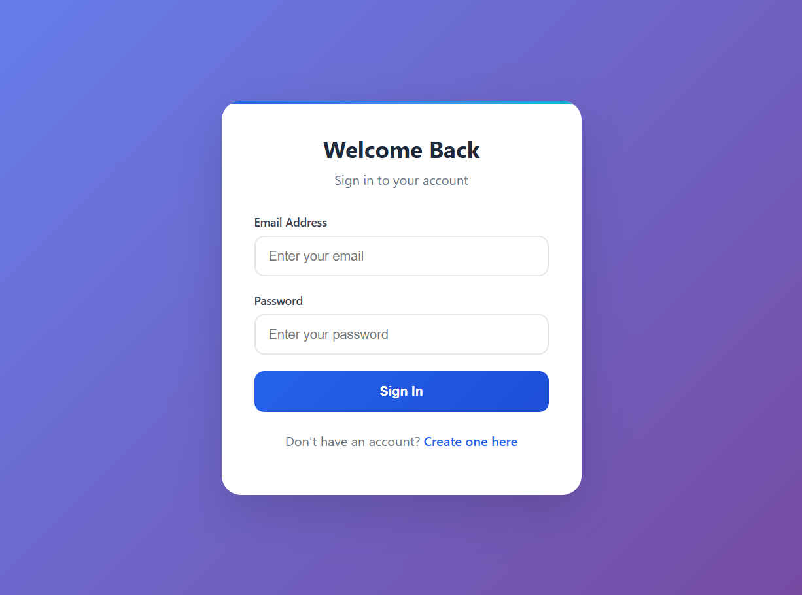
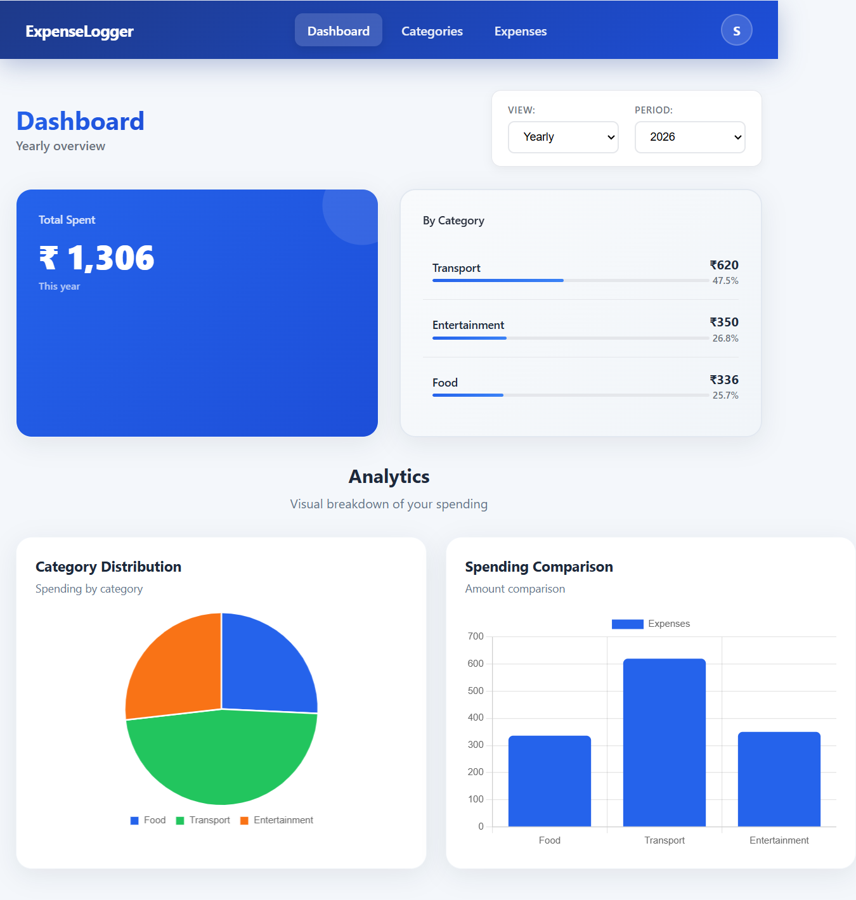
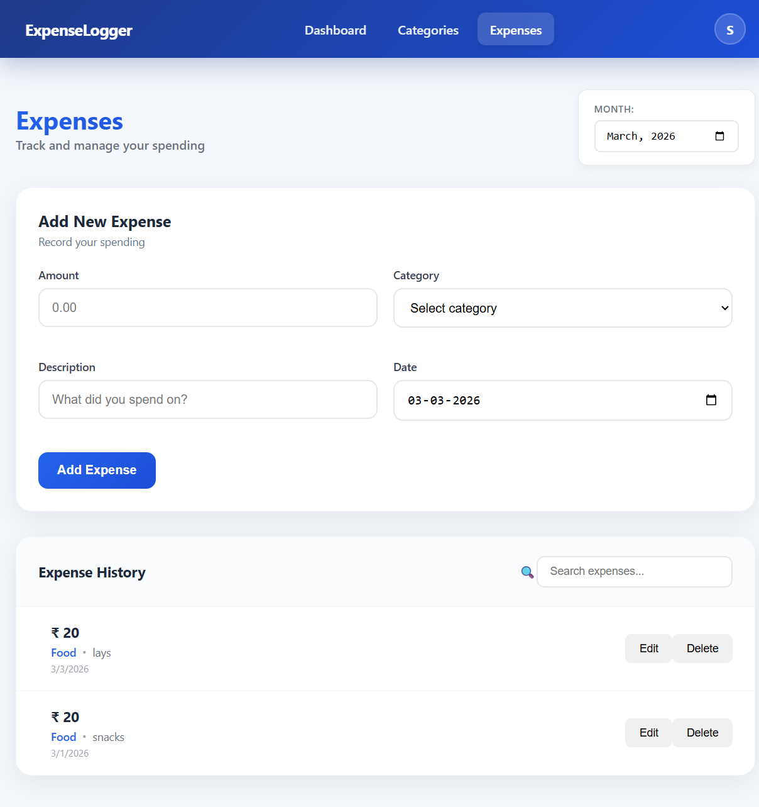
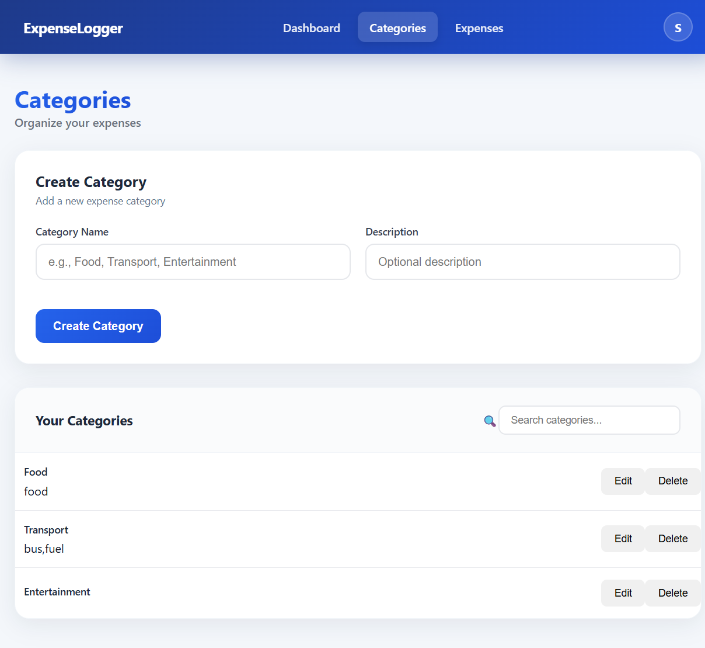

# Expense Tracker - MERN Stack

A full-stack expense tracking application built with MongoDB, Express.js, React, and Node.js. Track your expenses, categorize them, and visualize your spending with interactive charts.

## Features

- 🔐 User authentication (Register/Login with JWT)
- 💰 Add, edit, and delete expenses
- 📁 Create and manage expense categories
- 📊 Interactive charts and data visualization
- 📱 Responsive design
- 🔒 Protected routes and secure API endpoints

## Screenshots

### Login Page


### Dashboard


### Expenses


### Categories


## Tech Stack

**Frontend:**
- React 19
- Vite
- React Router DOM
- Axios
- Chart.js & React-Chartjs-2
- CSS3

**Backend:**
- Node.js
- Express.js
- MongoDB with Mongoose
- JWT Authentication
- Bcrypt.js for password hashing
- CORS

## Project Structure
```
MERN_Project/
├── backend/
│ ├── config/ # Database configuration
│ ├── controllers/ # Route controllers
│ ├── middleware/ # Auth middleware
│ ├── models/ # Mongoose models
│ ├── routes/ # API routes
│ ├── .env # Environment variables
│ └── server.js # Entry point
└── frontend/
├── src/
│ ├── api/ # Axios configuration
│ ├── components/ # React components
│ ├── context/ # Auth context
│ ├── pages/ # Page components
│ └── styles/ # CSS files
└── index.html
```

## Installation

### Prerequisites
- Node.js (v14 or higher)
- MongoDB (local or Atlas)
- npm or yarn

### Setup

1. **Clone the repository**
   ```bash
   git clone https://github.com/Sachit-281206/Expense_Logger-MERN.git
   cd MERN_Project
   ```

2. **Backend Setup**
    ```bash
    cd backend
    npm install
    ```

3. **Create .env file in backend folder**
   ```env
   MONGO_URI=your_mongodb_connection_string
   JWT_SECRET=your_jwt_secret_key
   PORT=5000
   ```

4. **Frontend Setup**
   ```bash
   cd ../frontend
   npm install
   ```

## Running the Application

1. **Start Backend Server**
   ```bash
   cd backend
   node server.js
   ```
   Backend runs on `http://localhost:5000`

2. **Start Frontend Development Server**
   ```bash
   cd frontend
   npm run dev
   ```
   Frontend runs on `http://localhost:5173`

## API Endpoints

### Authentication
- `POST /api/auth/register` - Register new user
- `POST /api/auth/login` - Login user

### Expenses
- `GET /api/expenses` - Get all expenses
- `POST /api/expenses` - Create new expense
- `PUT /api/expenses/:id` - Update expense
- `DELETE /api/expenses/:id` - Delete expense

### Categories
- `GET /api/categories` - Get all categories
- `POST /api/categories` - Create new category
- `PUT /api/categories/:id` - Update category
- `DELETE /api/categories/:id` - Delete category

## Environment Variables

Create a .env file in the backend directory with the following variables:

| Variable | Description |
|----------|-------------|
| `MONGO_URI` | MongoDB connection string |
| `JWT_SECRET` | Secret key for JWT token generation |
| `PORT` | Backend server port (default: 5000) |

## License
This project is for educational purposes.


